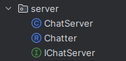
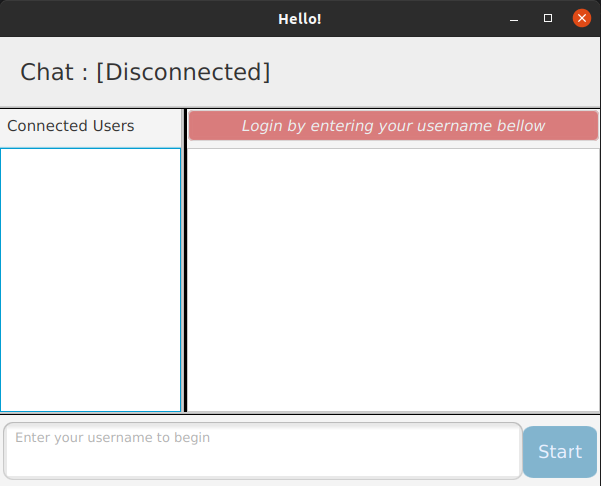
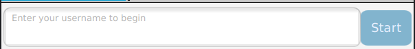
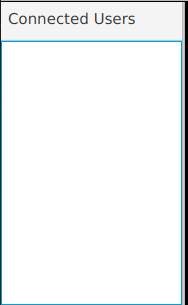
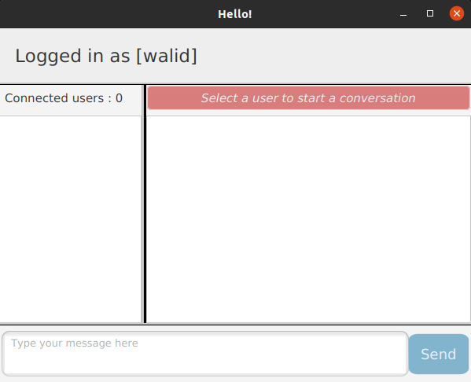
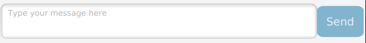
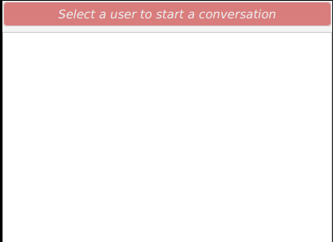

# Rapport de projet de Securite des Systemes d'information
### ILISI3 - Projet: Application de chat sécurisé
### Réalisé par: ` zaddi andelmajid ` 
## Introduction
Ce projet a pour but de mettre en place d'une application desktop de chat sécurisé. L'application est développée en Java et utilise le protocole TLS pour sécuriser les communications entre les utilisateurs. Le protocole TLS est implémenté à l'aide de la librairie BouncyCastle. L'application utilise le protocole TLS pour sécuriser les communications entre les utilisateurs. Le protocole TLS est implémenté à l'aide de la librairie BouncyCastle. L'application utilise le protocole TLS pour sécuriser les communications entre les utilisateurs. Le protocole TLS est implémenté à l'aide de la librairie BouncyCastle. L'application utilise le protocole TLS pour sécuriser les communications entre les utilisateurs. Le protocole TLS est implémenté à l'aide de la librairie BouncyCastle. 
L'application utilise RMI pour echange des messages entre les utilisateurs en passant par un serveur (RMI Registry).
l'application permet de créer un compte utilisateur, de se connecter et de discuter avec les autres utilisateurs connectés.
l'application utilise le protocol de chiffrement RSA pour sécuriser les communications entre les utilisateurs, donc chaque utilisateur possède une paire de clés (publique et privée) pour chiffrer et déchiffrer les messages.
## Architecture
L'application est composée de 3 parties:
- Client: l'interface graphique de l'application et le module de chiffrement des messages (RSA) avec des tests unitaires pour chaque fonctionnalité.
- Server: le serveur RMI
- 
- Common: les classes communes entre le client et le serveur

## Fonctionnalités
### I- Interface Initiale de l'application

#### 1- Connexion à l'application avec un username

#### 2- recherche automatique des utilisateurs connectés au serveur apres la connexion avec un username (RMI Registry)

### II- Interface principale de l'application

#### 1- envoi de messages chiffrés entre les utilisateurs

#### 2- zone de conversation avant selection d'un utilisateur

